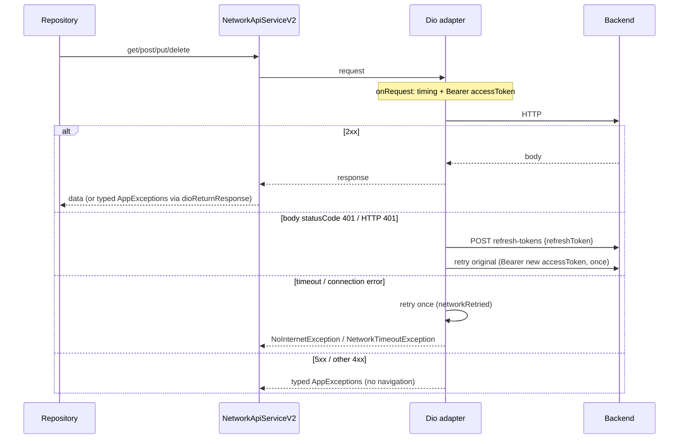

# EverQpid — Network Layer (Phase 4)

**Date:** 2026-07-21  
**Scope:** Networking only. Auth token rules from Phase 2 unchanged. Env hosts from Phase 3 unchanged.

---

## Architecture

```
Repositories (×21)
        │
        ▼
NetworkApiServiceV2.instance   ← singleton (factory NetworkApiServiceV2() → same)
        │
        ├── adapter (Dio)      ← API calls + auth/refresh interceptors
        └── _s3Adapter (Dio)   ← signed-URL uploads only (no auth headers)
                │
                ▼
        AppConfig / AppUrl.baseurl
```

| Piece | Location |
|-------|----------|
| Shared API service | `lib/Data/Network/network_api_service_v2.dart` |
| Logger | `lib/Data/Network/network_logger.dart` |
| Exceptions | `lib/Data/Exceptions/app_exceptions.dart` |
| Navigator (no `main.dart`) | `lib/Settings/utils/app_navigator.dart` |
| Deleted | `lib/Data/Network/network_api_service.dart` (dead commented HTTP client) |

---

## Request lifecycle



---

## Interceptor order

1. **Request** — stamp `startedAt`, set `Authorization: Bearer accessToken` (skipped on refresh path)
2. **Logging** — debug-only method/path/duration; Authorization scrubbed
3. **Response** — body `statusCode == 401` → single-flight refresh → retry once
4. **Error** — map connectivity/timeout (retry once) → HTTP 401 refresh → map 5xx to typed exceptions
5. **Final** — public methods unwrap `DioException.error` → throw `AppExceptions` to repositories

There is **one** refresh path: `refreshAccessToken()` (static single-flight `Completer`).

---

## Retry policy

| Case | Behavior |
|------|----------|
| Connection / send / receive timeout | Retry **once** (`extra.networkRetried`) |
| HTTP / body 401 | Refresh once, then retry original once (`extra.retried`) |
| Second 401 after refresh | Logout via `AppNavigator` → splash |
| 4xx (non-401) / 5xx | No automatic retry |

---

## Refresh flow

Unchanged from Phase 2:

- Refresh token only in **POST body** to `AppUrl.refreshToken`
- Never as `Authorization`
- Success → `LoggedInUser.tokenUpdate` → persist → retry with access token
- Failure → clear storage → navigate splash

---

## Exception hierarchy

| Status / cause | Type |
|----------------|------|
| Connection failure | `NoInternetException` |
| Timeout | `NetworkTimeoutException` |
| 400 | `BadRequestException` |
| 401 / 403 | `UnauthorisedException` |
| 404 | `NotFoundException` |
| 409 | `ConflictException` |
| 410 | `GoneException` |
| 422 | `ValidationException` |
| 429 | `RateLimitException` |
| 500 | `FetchDataException` |
| 503 | `ServiceUnavailableException` |
| Other | `FetchDataException` |

All extend `AppExceptions`.

---

## Timeout policy

| Timer | Value |
|-------|-------|
| Connect | 15s |
| Receive | 30s |
| Send | 30s |

(Previously 6 min / 60 min.)

---

## Logging

`NetworkLogger`:

- **Debug:** request method/path (+ scrubbed headers), response status + duration
- **Release:** errors only (type + status, no bodies)
- **Never logs:** Authorization, refresh/access tokens, passwords, OTPs, payment signatures

---

## Navigation decoupling

- `AppNavigator.key` lives in `Settings/utils/app_navigator.dart`
- `main.dart` exposes `navigatorKey = AppNavigator.key` for compatibility
- Network layer and `NotificationNavigator` import `AppNavigator`, **not** `main.dart`
- Network layer does **not** push the no-internet route on 5xx (UI may handle typed exceptions later)

---

## S3 / signed uploads

Repositories call `NetworkApiServiceV2.uploadToSignedUrl` / `putMethod` — they must not construct `Dio()`.
Signed uploads use `_s3Adapter` (no API auth headers).
