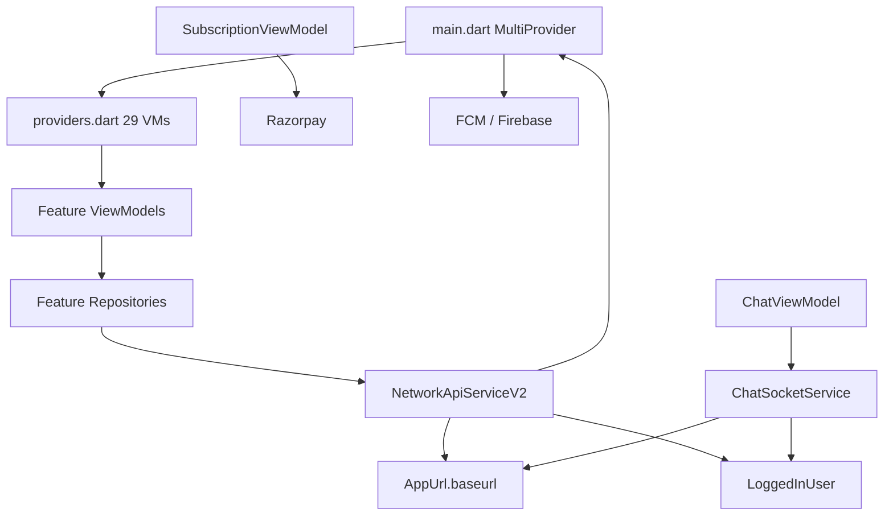

# EverQpid — Project Audit (Phase 1)

**Date:** 2026-07-21  
**App:** EverQpid (`everqpidapp`)  
**Version:** 1.0.26+26  
**Scope:** Read-only analysis of ~193 Dart files under `lib/`  
**Graph:** graphify-out (3387 nodes · 4873 edges · 179 communities)  
**Constraint:** No UI redesign, no business-logic removal — production hardening only.

---

## Executive summary

The app is a feature-first MVVM Flutter client (Provider + Dio + Firebase + Socket.IO + Razorpay) already partially web-aware (`kIsWeb` guards). It is **not production-ready** until critical auth, env, and network issues are fixed.

| Priority | Finding | Phase |
|----------|---------|-------|
| P0 | `Authorization: Bearer refreshToken` on normal APIs (and socket auth) | 2 |
| P0 | Hardcoded API hosts; empty `env.dart`; no `--dart-define` | 3 |
| P0 | Duplicate/dead network layer; N× `NetworkApiServiceV2()`; extreme timeouts | 4 |
| P1 | 28 files >500 lines; `preferences_screen.dart` = 3300 lines | 7 |
| P1 | 29 ViewModels registered globally at app start | 8 |
| P1 | `dart:io` in 11 files; no path URL strategy; placeholder web Google client ID | 10 |
| P2 | Dead widgets/services; copy file; commented legacy network file | 5–6 |
| P2 | ~705 `log(` / sparse tests / JWT in SharedPreferences | 11–13 |

---

## 1. Folder structure

```
lib/
├── main.dart
├── env.dart                          # empty stubs (unused)
├── firebase_options.dart
├── Data/
│   ├── Exceptions/app_exceptions.dart
│   ├── LocaStorage/                  # typo: LocalStorage
│   ├── Network/
│   │   ├── base_api_service.dart
│   │   ├── network_api_service.dart  # DEAD — fully commented
│   │   └── network_api_service_v2.dart
│   ├── Response/AppResponse/
│   └── services/                     # FCM, location, notifications, permissions
├── Features/                         # 142 files — feature-first MVVM
│   ├── onboarding/ (28)
│   ├── profile/ (26)
│   ├── settings/ (15)
│   ├── messages/ (14)
│   ├── clan2.0/ (10)
│   ├── matches/ (9)
│   ├── profileactions/ (7)
│   ├── home/ (6), verification/ (6)
│   ├── subscription/ (5), superlikes/ (4)
│   ├── common_widgets/ (4)
│   ├── mainscreen/ (2), location/ (2), FCM/ (2)
│   ├── itsamatch/ (1), splash/ (1)
└── Settings/                         # 34 files — constants, routes, responsive, helpers
    ├── constants/app_url.dart
    ├── helper/providers.dart
    ├── responsive/
    └── utils/
```

**Dart file counts:** `lib/` = **193** (Features 142 · Settings 34 · Data 14 · root 3)

**Platforms present:** Android, iOS, Web, Linux, macOS, Windows  
**Assets:** 13 images under `assets/images/` (all referenced) + `assets/icon/appIcon.jpeg` (launcher icons only)

---

## 2. Architecture

### Pattern (as implemented)

```
View (screen/widget)
  → ViewModel (ChangeNotifier)
    → Repository
      → NetworkApiServiceV2 (Dio)
        → AppUrl.baseurl
```

- **State:** Provider (`ChangeNotifierProvider` list in `lib/Settings/helper/providers.dart`)
- **Networking:** Dio via `NetworkApiServiceV2` implementing `BaseApiService`
- **Auth identity:** static `LoggedInUser` + SharedPreferences
- **Realtime:** `ChatSocketService` singleton (Socket.IO)
- **Payments:** Razorpay (key from order API response — good)
- **Push:** Firebase Messaging + local notifications
- **Responsive:** `Settings/responsive/` already exists (breakpoints, content max width)

### God nodes (graphify — highest coupling)

1. `ProfileViewModel` (29)
2. `AuthViewModel` (22)
3. `NetworkApiServiceV2` (21)
4. `ProfileActionsViewModel` (19)
5. `_resetAllViewModels` (19)
6. `GetProfileViewModel` (18)
7. `ClanViewModel` (17)
8. `HomeViewModel` / `ChatViewModel` / `EmailAuthViewModel`

### Dependency graph (simplified)



**Architectural smells**

| Smell | Detail |
|-------|--------|
| Layer leak | `network_api_service_v2.dart` imports `main.dart` for `navigatorKey` |
| God network | Every repository `new NetworkApiServiceV2()` — separate Dio + interceptors per repo |
| Static session | `LoggedInUser` globals — hard to test / easy to leak |
| Dual profile domains | `home/` and `profile/` both have `profile_repository.dart` + `user_profile_model.dart` (different responsibilities, same names) |

---

## 3. Dependency graph (runtime packages)

| Package | Role | Notes |
|---------|------|-------|
| `provider` | State | Keep |
| `dio` | HTTP | Keep; consolidate instances |
| `http` | Declared | Only referenced in **commented** old network file — candidate removal Phase 4/5 |
| `firebase_core` / `auth` / `messaging` | Auth + push | Keep |
| `socket_io_client` | Chat | Keep; fix token |
| `razorpay_flutter` | Payments | Keep; web support TBD |
| `shared_preferences` | Session | Keep; consider flutter_secure_storage for tokens (Phase 11) |
| `geolocator` / `geocoding` / `permission_handler` | Location | Web soft-path exists |
| `google_sign_in` | Social | Web client ID is placeholder |
| `facebook_app_events` | Analytics | Correctly null on web |
| `webview_flutter` | Policies | Web/desktop caveats |
| `record` / `just_audio` / `path_provider` | Voice notes | `dart:io` paths — web risk |
| `flutter_contacts` | Hide contacts | Mobile-centric |
| `csc_picker_plus` | City picker | Clan feature |

---

## 4. Dead code

| Item | Evidence | Recommended action |
|------|----------|-------------------|
| `lib/Data/Network/network_api_service.dart` | Entire file commented (~441 lines); zero live imports | Delete (Phase 5) |
| `lib/env.dart` `Environments` | Empty strings; 0 references | Replace with `lib/config/` (Phase 3) |
| `Svgs` | Near-empty `svgs.dart` (3 lines); 0 refs | Delete or implement |
| `ErrorMsg`, `SuccessMsg`, `SingleSuccessMsg`, `LoadingBar` | 0 external refs | Verify then delete |
| `LocalStorageService`, `PermissionsService`, `Validator` | 0 external refs | Verify then delete |
| `lib/Settings/common/widgets/no_internet copy.dart` | Copy filename + `dart:io` | Delete after confirming unused |
| Large commented blocks | e.g. preferences (2407/3300 lines `//`), old network, subscription | Strip in Phase 5/7 |
| `package:http` | Only in dead file | Remove from pubspec if unused |

*Note: Low-ref StatefulWidget private classes are normal — not dead.*

---

## 5. Duplicate code

| Pair | Similarity | Notes |
|------|------------|-------|
| `home/.../profile_repository.dart` vs `profile/.../profile_repository.dart` | ~7% | Same filename, different APIs — rename for clarity, do not blindly merge |
| `home/.../user_profile_model.dart` vs `profile/.../user_profile_model.dart` | ~14% | Same — risk of wrong import |
| `NetworkApiService` (old) vs `V2` | Old fully commented | Delete old |
| Ad-hoc `Dio()` | `chat_repository.dart`, `photo_upload_repository.dart` | Bypass interceptors/auth — consolidate into V2 |
| Many `NetworkApiServiceV2()` | ~20 repositories | Should be one shared instance / DI |

---

## 6. Unused imports / import casing

### Casing (Linux CI risk)

Convention in tree: **`Features/`** (Pascal). Mixed lowercase `features/` imports:

| File | Import |
|------|--------|
| `lib/Settings/utils/p_routes.dart` | `package:everqpidapp/features/messages/view/chat_screen.dart` |
| `lib/Features/matches/view_model/likes_view_model.dart` | `.../features/matches/repository/...` |
| `lib/Features/matches/view/matches_screen.dart` | `.../features/matches/model/...` |
| `lib/Features/profile/view/profile_screen.dart` | `.../features/profile/view/edit_profile_screen.dart` |

Works on macOS/Windows case-insensitive FS; **breaks on Linux**. Fix in Phase 6.

### Unused imports

Not exhaustively analyzed with analyzer. Phase 14 should run:

```bash
flutter analyze
dart fix --apply
```

Expect unused imports after Phase 5 deletions.

---

## 7. Unused assets

| Asset | Status |
|-------|--------|
| `assets/images/*` (13 files) | Used via `Images` / screens |
| `assets/icon/appIcon.jpeg` | Not referenced in Dart; used by `flutter_launcher_icons` — **keep** |

No orphaned image assets detected in Dart references.

---

## 8. Large files (>500 lines)

| Lines | File |
|------:|------|
| 3300 | `Features/profile/view/preferences_screen.dart` |
| 1599 | `Features/home/view/home_screen.dart` |
| 1534 | `Features/profile/view/edit_profile_screen.dart` |
| 1300 | `Features/common_widgets/all_profile_detail_screen.dart` |
| 944 | `Features/subscription/view/subscription_screen.dart` |
| 898 | `Features/profile/view/edit_interests_screen.dart` |
| 888 | `Features/settings/view/support_screen.dart` |
| 871 | `Features/clan2.0/view/clan_list_screen.dart` |
| 861 | `Features/profile/view/edit_about_screen.dart` |
| 846 | `Features/onboarding/view/profile_intro_screen.dart` |
| 772 | `Features/profile/view/edit_work_and_education_screen.dart` |
| 769 | `Features/onboarding/view/otp_verification_screen.dart` |
| 762 | `Features/messages/view/chat_screen.dart` |
| 757 | `Features/onboarding/view/photo_upload_screen.dart` |
| 746 | `Features/messages/view_model/chat_view_model.dart` |
| 727 | `Data/Network/network_api_service_v2.dart` |
| 721 | `Features/profile/view_model/update_profile_view_model.dart` |
| 620–519 | matches, main, delete_account, phone_login, messages, preferences_vm, hide_contact, chat_socket, location_permission, subscription_bottom_sheet, clan_home |

**28 files ≥500 lines.** Phase 7: extract widgets/dialogs/sheets **without UI change**. Prefer deleting comment mass first (`preferences_screen` is ~73% comments).

---

## 9. Large widgets / rebuild hotspots

| Signal | Detail |
|--------|--------|
| `Consumer*` usages | **47** |
| `Selector*` usages | **1** |
| Worst Consumer density | `preferences_screen` (8), `hide_contact_screen` (5), `edit_profile_screen` (4) |
| Root rebuild | `MyApp` wraps entire `MaterialApp` in `Consumer<LocationViewModel>` **and** `builder` uses `context.watch<LocationViewModel>` — double listen |
| KeepAlive | Only `messages_screen`, `matches_screen` |
| RepaintBoundary | Not used meaningfully |
| Image cache | `Image.network` (11) + `NetworkImage` (20); **no** `CachedNetworkImage` |

---

## 10. Circular dependencies

| Cycle / leak | Impact |
|--------------|--------|
| `network_api_service_v2.dart` → `main.dart` (`navigatorKey`) | Data layer depends on app entry; hard to unit-test; risk of init-order bugs |
| `notificationhelper.dart` → `main.dart` | Same |
| `delete_account_screen.dart` → `main.dart` | UI → entry |

**Fix direction (later phases):** move `navigatorKey` to `Settings/utils/app_navigator.dart` (or similar) so Data does not import `main.dart`.

No package-level import cycle beyond this entry-point coupling was required for the audit; graph shows Network community tightly coupled to navigation.

---

## 11. Slow widgets / performance issues

| Issue | Location / evidence |
|-------|---------------------|
| Monster build methods | preferences / home / edit_profile / all_profile_detail |
| Global notify storms | 29 app-wide ChangeNotifiers; any `notifyListeners` can rebuild distant Consumers |
| Nested Consumers | preferences, hide_contacts, edit_profile |
| Extreme Dio timeouts | connect **6 min**, receive **60 min** — hangs UX, holds connections |
| Artificial refresh delay | `await Future.delayed(1400ms)` after token refresh |
| Ad-hoc Dio uploads | bypass shared timeouts/logging/auth |
| No pagination audit | home/matches lists need Phase 9 verification |
| Socket singleton listeners | Chat + Messages VMs attach listeners — dispose path must be verified (delete account resets) |
| Logging volume | ~705 `dart:developer` `log(` calls — cost in profile builds |

---

## 12. Memory issues

| Issue | Detail |
|-------|--------|
| Eager providers | All 29 VMs created at `runApp` — retain repositories, Dio, Razorpay, socket hooks for whole session |
| `SubscriptionViewModel` | Constructs Razorpay in constructor even if user never opens paywall |
| `ChatSocketService` singleton | Survives navigation; must dispose on logout (partially handled in delete-account flow) |
| Message local history | SharedPreferences chat history can grow unbounded |
| Multiple Dio adapters | Each `NetworkApiServiceV2()` owns interceptors + pending-request lists |
| Static `LoggedInUser` | Tokens remain in memory until explicit clear |

---

## 13. Security issues

### P0 — Wrong bearer token

In `network_api_service_v2.dart`, **all** of these use `LoggedInUser.refreshToken`:

- Request interceptor `Authorization` header
- 401 retry paths (multiple)
- `_handleTokenRefresh` retry header

`LoggedInUser.accessToken` is stored and used for splash gate, but **not** sent on APIs.

Socket auth also sends refresh token:

```dart
// chat_socket_service.dart — join payload
"token": _refreshToken,  // from LoggedInUser.refreshToken
```

**Correct model:** Access token on APIs/socket; refresh token **only** in refresh-token request body.

### Other security

| Issue | Severity | Notes |
|-------|----------|-------|
| JWT in SharedPreferences | High | Readable on rooted/jailbroken devices; web = localStorage-equivalent |
| Hardcoded hosts | High | `https://server.everqpid.com`, `http://15.206.227.36:8000` |
| Firebase API keys in repo | Medium | Expected for client apps; still rotate + restrict by domain/bundle |
| Placeholder Google Sign-In web client | High (web) | `YOUR_WEB_CLIENT_ID.apps.googleusercontent.com` in `web/index.html` |
| Sensitive logs | Medium | Matches screen logs `accessToken`; payment signature logged |
| `validateStatus: status < 500` | Medium | Treats 4xx as success path — easy to mishandle auth |
| CORS | Ops | Client cannot fix; ensure server allows web origin |
| XSS | Low–Med | WebView for privacy/terms — ensure no untrusted HTML injection |
| CSRF | Low | Bearer API; still avoid cookie auth on web without CSRF |
| Empty `Environments` | — | Secrets not centralized |

---

## 14. API / network issues

| Issue | Detail |
|-------|--------|
| Dual base URL flags | `isProduction = true` hardcoded; staging IP leftover |
| `httpBaseUrl` | Separate host list for dead HTTP client |
| Refresh path matching | Checks `/refresh-token` vs route `refresh-tokens` — fragile |
| Duplicate 401 handlers | Body `statusCode == 401` **and** HTTP 401 `onError` — overlapping / duplicated Completer logic |
| No connectivity preflight | Relies on Dio errors; navigates to no-internet on **5xx** (wrong semantic) |
| Repository error mapping | Inconsistent try/catch + EasyLoading across repos |
| Photo/chat raw Dio | No shared auth interceptor |
| Timeouts | Unreasonably long |

---

## 15. Provider lifecycle issues

From `lib/Settings/helper/providers.dart`:

- **29** `ChangeNotifierProvider`s registered in root `MultiProvider`
- Onboarding-only VMs (`PhotoUpload`, `Signup`, `EmailAuth`, `Auth`) live for entire app lifetime
- Feature VMs (`Clan`, `SuperLikes`, `Verification`, `Contacts`) created even if unused
- Dispose relies on Provider defaults; heavy resources (Razorpay, socket) need explicit cleanup — partially present on logout/delete
- `_resetAllViewModels` (graph) suggests manual reset exists — verify completeness in Phase 8
- Almost no `Selector` — over-rebuild risk

---

## 16. Web compatibility issues

| Area | Status |
|------|--------|
| `kIsWeb` in main / location block | Partial — good start |
| Facebook events | Correctly disabled on web |
| FCM background handler | Skipped on web; `firebase-messaging-sw.js` present — needs validation |
| `dart:io` imports | **11 files** — compile risk for web (File, Platform, SocketException) |
| URL strategy | **Not set** (`usePathUrlStrategy` absent) — hash URLs / refresh 404 risk |
| SEO / meta | Generic “A new Flutter project.” in `index.html` / manifest |
| PWA | Manifest exists; theme colors default blue; title `everqpidapp` |
| Google Sign-In | Placeholder client ID |
| Razorpay Flutter | Mobile plugin — web payment path unverified |
| Contacts / record / geolocator | Limited or stub on web |
| Responsive helpers | Present under `Settings/responsive/` — adopt more broadly |
| Deferred imports | Not used |
| Tree shaking | Standard Flutter web release — unblock after dead code removal |

---

## 17. Testing & quality gates

| Item | Status |
|------|--------|
| Unit / repo / VM tests | Missing |
| Widget tests | Default `test/widget_test.dart` only |
| Integration tests | None |
| Golden tests | None |
| `flutter analyze` | Not run in this phase (Phase 14) |
| CI | Not audited here |

---

## 18. Logging

| Mechanism | Count (approx) |
|-----------|----------------|
| `dart:developer` `log(` | ~705 |
| `debugPrint` | ~57 |
| `print(` | ~8 (incl. FCM background) |

No centralized Logger with release gating. Phase 12: single logger; silence verbose in release; never log tokens/signatures.

---

## 19. Phase roadmap (locked order)

| Phase | Focus | Primary deliverable |
|------:|-------|---------------------|
| 1 | Analysis | `docs/PROJECT_AUDIT.md` ← **this file** |
| 2 | Auth | Access token on APIs; refresh-only on refresh endpoint |
| 3 | Env | `lib/config/*` + `--dart-define` |
| 4 | Network | Single Dio service; retries; logging; exception map |
| 5 | Cleanup | Dead/duplicate removal → `docs/CLEANUP_REPORT.md` |
| 6 | Imports | `Features/` casing only |
| 7 | Split large files | widgets/dialogs without UI change |
| 8 | Providers | Scope + dispose + Selector |
| 9 | Performance | const, KeepAlive, lists, images |
| 10 | Web | URL strategy, dart:io guards, PWA/SEO |
| 11 | Security | Token storage, log scrubbing |
| 12 | Logging | Logger service |
| 13 | Testing | Repo/VM/widget + integration plan |
| 14 | Builds | analyze / format / test / web+apk+aab |
| 15 | Docs | ARCHITECTURE, API_FLOW, etc. |

---

## 20. Appendix — graphify god nodes

```
ProfileViewModel, AuthViewModel, NetworkApiServiceV2,
ProfileActionsViewModel, _resetAllViewModels, GetProfileViewModel,
ClanViewModel, HomeViewModel, ChatViewModel, EmailAuthViewModel
```

Full community map: `graphify-out/GRAPH_REPORT.md`.

---

*End of Phase 1 audit. No application code was modified.*
)
