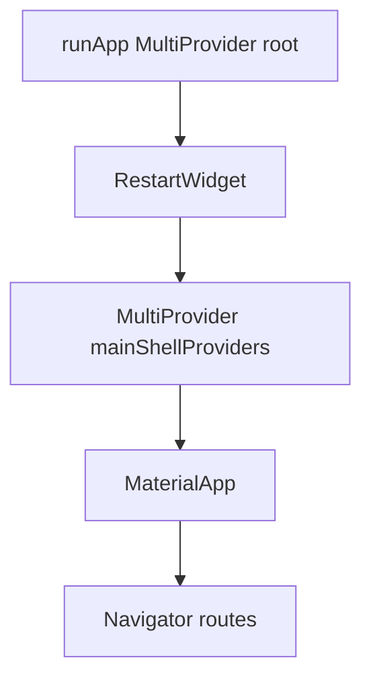

# Phase 6 — Provider Lifecycle

**Date:** 2026-07-21  
**Scope:** Reduce root providers, scope feature VMs, cut rebuild fan-out, fix heavy-object disposal.  
**Constraint:** No UI redesign, no API/auth/network changes, behavior unchanged.

---

## Before → After metrics

| Metric | Before | After |
|--------|--------|-------|
| Root `ChangeNotifierProvider`s | 26 | **9** |
| Shell providers (below `RestartWidget`, above `MaterialApp`) | 0 | **12** |
| Route/feature-scoped creates | 1 (`ProfileActions.value`) | Support, Preferences, Your Likes, Contacts, Verification |
| Live `Consumer<…>` | 35 | **26** |
| `Selector<…>` | 0 | **6** |
| `context.watch` | 2 | **0** |
| `context.select` | 0 | **2** |
| Analyzer errors / warnings | 0 / 0 | **0 / 0** |

---

## Provider hierarchy

### Root (survive app restart until process death; reset on logout)

| ViewModel | Why global |
|-----------|------------|
| `LocationViewModel` | Hard-blocks UI in `MaterialApp.builder` |
| `AuthViewModel` | Phone login → OTP |
| `EmailAuthViewModel` | Email login → OTP → onboarding |
| `SignupViewModel` | Multi-step signup |
| `PhotoUploadViewModel` | Photo upload ↔ profile intro |
| `GetProfileViewModel` | Session profile cache across tabs/edits |
| `ChatViewModel` | Socket chat + push navigation |
| `LogoutViewModel` | Logout dialog |
| `FCMViewModel` | Token refresh from MainScreen |

### Shell (created lazily; **disposed on `RestartWidget.restartApp`**)

| ViewModel | Why shell |
|-----------|-----------|
| `MainScreenViewModel` | `signOut` / Firebase clear |
| `HomeViewModel` | Tab 0 + `_refreshTabData` |
| `MatchesViewModel` / `LikesViewModel` | Tab 1 |
| `MessagesViewModel` | Tab 3 + socket list |
| `ClanViewModel` | Tab 2 + clan sub-routes |
| `MatchingViewModel` / `RecentPassViewModel` / `SuperLikesViewModel` | Home + profile detail |
| `ProfileViewModel` | Edit-profile stack |
| `ProfileActionsViewModel` | Report / block / blocked list |
| `SubscriptionViewModel` | Paywall sheet + screen (shared Razorpay) |

Shell sits **above `MaterialApp`** so pushed routes still resolve providers, and **below `RestartWidget`** so logout/delete remount disposes them.

### Feature / route scoped (`create` at entry)

| ViewModel | Entry |
|-----------|--------|
| `SupportViewModel` | Settings / `PPages.supportScreen` |
| `PreferencesViewModel` | Profile → Preferences |
| `LikedProfilesViewModel` | Profile → Your Likes |
| `ContactsViewModel` | Settings → Hide Contacts (+ `.value` to Manage Hidden) |
| `VerificationViewModel` | Verify intro → Selfie capture |

---

## Lifecycle rules

1. **IndexedStack** on MainScreen keeps all five tabs alive — do not dispose tab VMs on tab switch.
2. **Logout / delete:** `_cleanupBeforeLogout()` (socket + local chat cache + audio recorder) → reset root VMs → `RestartWidget.restartApp` (shell dispose).
3. **Chat:** `onChatInvisible()` detaches socket listeners when leaving chat; `initChat` re-attaches.
4. **Subscription:** payment callbacks cleared in screen/sheet `dispose` and VM `reset`/`dispose`; Razorpay cleared in VM `dispose`.
5. Providers are **lazy** (`ChangeNotifierProvider` default) — Razorpay / Messages socket only construct on first read.

---

## Rebuild improvements

| Change | Effect |
|--------|--------|
| Removed unused outer `Consumer<LocationViewModel>` + `context.select` gate | Location notifies no longer double-rebuild entire `MaterialApp` |
| Removed dead `Consumer<LikesViewModel>` around Matches `TabBarView` | Likes notifies no longer rebuild tab shell |
| Super Like buttons → `Selector<…, bool>` | Only loading flag rebuilds button |
| Support screen → `context.select` busy flags | Form local state not tied to full VM watch |
| Preferences app bar → `Selector` | Save/reset only |
| Clan city chip → `Selector` on display name | List body unaffected by location label |
| Hide-contacts Select All → `context.read` | No listener |
| Hide-contacts Manage → `Selector` on `hiddenCount` | Narrow rebuild |
| Recent passes nested Consumer removed | One listener instead of two |
| Chat subscription banner → `Selector` | Banner not tied to every message notify |

---

## Memory improvements

- Root provider count **26 → 9**.
- Shell VMs (including Razorpay + Messages socket listeners) **dispose on logout/delete restart**.
- Feature VMs only live while their routes are open.
- Chat socket listeners no longer stay attached after leaving a chat.
- Payment callbacks no longer retain disposed screen `State`s.
- Audio recorder singleton disposed on logout and cleared for re-create.

---

## Remaining optimization work (later phases)

- Split chat message list vs presence into separate listenables (bigger VM change).
- Nested navigator under authenticated shell if we want shell providers to not exist during splash/onboarding at all.
- Replace remaining broad `Consumer`s on large edit/preferences bodies with field-level selects where profitable.
- Deprecations (`withOpacity`, `WillPopScope`) and `use_build_context_synchronously` infos.

---

## Compile confirmation

`dart format lib` · `dart fix --apply` · `flutter analyze` → **0 errors, 0 warnings** (infos only).

**Phase 6 complete. Do not start Phase 7 until requested.**
